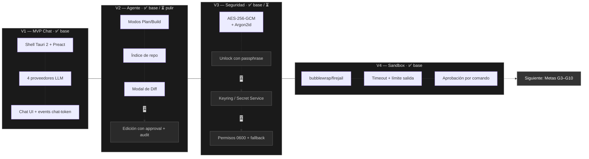

# Crafter — Lightweight AI Coding Agent for Linux

Crafter is a **model-agnostic AI coding agent** for Linux desktops, built with
**Tauri 2 (Rust backend)** and a **Preact frontend**. It is designed to run
fluidly on old or modest hardware: target is **<500 MB RAM idle** and **<5 s startup**.

The agent connects to any LLM provider (OpenAI, Anthropic, Gemini, Ollama local,
or any OpenAI-compatible endpoint), answers in **Plan** or **Build** mode, edits
your repository with visual diff approval, and runs commands inside a
**kernel-level sandbox** (`bubblewrap`/`firejail`).

> **Name note:** the code occasionally refers to the product as “Stark” or “Crafter”—
> same application.

---

## Core value props

- **Multi-provider** — OpenAI, Anthropic, Gemini, Ollama local, and any
  OpenAI-compatible endpoint (Groq, Mistral, OpenRouter, Pollinations, LM Studio…).
- **Plan / Build modes** — Plan only analyzes; Build proposes real file edits that
  the user approves via a visual diff.
- **Sandboxed terminal** — commands run under `bubblewrap`/`firejail` with
  per-command approval, timeout, and stdout/stderr streaming.
- **Encryption at rest** — AES-256-GCM with an Argon2id-derived master key;
  provider configs and API keys never touch disk in plaintext.
- **Hardware-aware** — detects RAM/VRAM and suggests Ollama model tiers that fit
  the machine (Lite → Pro).
- **Privacy** — zero telemetry, local-only mode via Ollama, keys typed in-app.
- **Voice input** — optional local dictation via an auto-installed `whisper.cpp`.

---

## Stack

| Layer                     | Technology                                                  |
| ------------------------- | ----------------------------------------------------------- |
| Shell                     | Tauri 2 (Rust)                                              |
| Frontend                  | **Preact** 10 + custom CSS (no UI framework)                |
| Runtime / package manager | Bun (+ Vite)                                                |
| Backend language          | Rust (Tokio, `async-trait`, `reqwest`, `serde`)             |
| Crypto                    | `argon2`, `aes-gcm`                                         |
| Sandbox                   | external `bwrap` / `firejail` binaries                      |
| Tests                     | Rust: `cargo test` (wiremock). Frontend: Vitest + happy-dom |

> ✅ **Stack locked: Preact JSX** (see `package.json`, `src/main.jsx`).
> All design docs (`goal.md`, `tech-design.md`, `shaping.md`, `breadboarding.md`, `spec.md`, `AGENTS.md`) reflect the **Preact** frontend. The only historical "Svelte 5" mentions are in old grilling/scratch transcripts.

---

## Repository layout

```
stark/
├── src/                     # Frontend (Preact JSX)
│   ├── main.jsx             # Entry point (mounts <App/>)
│   ├── App.jsx              # Global state, routing, modals orchestration
│   ├── i18n.js              # es/en strings
│   ├── components/          # ChatView, CodeView (sandbox console), Sidebar,
│   │   │                    # ModelSelectorModal, ProviderManagerModal, DiffModal,
│   │   │                    # UnlockModal, TerminalModal, CustomSelect, Logo, …
│   │   └── pages/           # ProjectsPage, DesignSystemPage, PluginHubPage, IntegrationsPage
│   └── styles/              # main.css (design tokens: --colors-*, --font-mono, --ui-scale)
├── src-tauri/               # Backend (Tauri 2 / Rust)
│   ├── src/
│   │   ├── main.rs          # Entrypoint → run()
│   │   ├── lib.rs           # All `#[tauri::command]` IPC handlers + builder
│   │   ├── providers/       # LLM adapters + routing
│   │   │   ├── mod.rs       # Provider trait + Anthropic/Gemini/OpenAI/Ollama/OpenAICompatible impls
│   │   │   ├── types.rs     # IPC payloads (SendChatPayload, StreamEvent, TokenUsage…)
│   │   │   └── router.rs    # Error classification, backoff, model visibility, fallback routes
│   │   ├── repo/            # indexer.rs, apply_edit() + audit log
│   │   ├── storage/         # crypto.rs, providers_store.rs, .enc persistence
│   │   ├── sandbox/         # bwrap execute_sandboxed_command()
│   │   ├── hardware/        # sysinfo hardware tier detection
│   │   ├── skills/          # load skills from a workspace (.claude/skills, etc.)
│   │   └── voice/           # whisper.cpp download/setup + transcribe/record
│   ├── capabilities/        # Tauri v2 permission scopes
│   ├── tauri.conf.json      # window config, AppImage bundle target
│   └── Cargo.toml
├── package.json
├── vite.config.ts
└── (docs.md)                # goal.md, tech-design.md, spec.md, shaping.md, DESIGN.md…
```

---

## How the app works (data flow)

```
[ Preact frontend ]                [ Rust backend ]
 msg typed                          invoke('send_chat_message', {payload})
      │                                        │
      ▼                                        ▼
 listen('chat-token')  ◄──────── Event emit  provider::chat_stream()
  │                                          POST /v1/chat/completions
  ▼                                              (Anthropic / Gemini / Ollama /
 append token to last assistant message          any OpenAI-compatible endpoint)
  (right now: whole response buffered)
```

- The UI talks to Rust exclusively via `invoke()` commands and `listen()` events
  (`@tauri-apps/api/core`, `@tauri-apps/api/event`).
- All commands are registered in `src-tauri/src/lib.rs` in the `invoke_handler!`.
- Everything runs on the local machine; no app-side server.

### Commands → module map

| Command                         | Module                     | Purpose                                                         |
| ------------------------------- | -------------------------- | --------------------------------------------------------------- |
| `send_chat_message`             | `providers::*`             | Send conversation → LLM, emit `chat-token`                      |
| `providers_*`                   | `storage::providers_store` | CRUD providers, save API keys, Ollama model detect/install      |
| `repo_index`                    | `repo::indexer`            | Gitignore-aware file tree                                       |
| `edit_apply`                    | `repo`                     | Write edited file + append `.crafter_audit.log`                 |
| `crypto_unlock`                 | `storage`                  | Derive master key from passphrase (Argon2id)                    |
| `storage_save` / `storage_load` | `storage`                  | Encrypted key/value store (`.enc` files)                        |
| `terminal_execute` (+`_ssh`)    | `sandbox`                  | Run command under bwrap/firejail, emit `terminal:stdout/stderr` |
| `hardware_detect`               | `hardware`                 | RAM/VRAM tier for Ollama model suggestions                      |
| `skills_list` / `skills_read`   | `skills`                   | Discover + read skills in the workspace                         |
| `voice_*`                       | `voice`                    | Install whisper, record (ffmpeg), transcribe (whisper-cli)      |

---

## Where data lives

| Data                                         | Location                           | Notes                                                                         |
| -------------------------------------------- | ---------------------------------- | ----------------------------------------------------------------------------- |
| Providers config, API keys, onboarding flags | `src-tauri/.crafter_storage/*.enc` | AES-256-GCM. Paths are **relative** to the process CWD (in dev: `src-tauri/`) |
| Audit log of edits                           | `src-tauri/.crafter_audit.log`     | Plaintext, append-only                                                        |
| Whisper binary + model                       | `~/.local/share/crafter/whisper/`  | Auto-installed on first dictation                                             |
| Project list (UI)                            | `localStorage` (`stark_projects`)  | Frontend only                                                                 |

⚠️ **Current gap:** chat sessions are **not persisted**. Messages live only in the
Preact store — closing the app loses the conversation. There is no chat-storage
command yet.

---

## Getting started

### System dependencies (Linux, Tauri 2 baseline)

Requires **WebKitGTK 4.1** (feeds into Ubuntu 22.04+, Debian 12+, Fedora 38+):

```bash
# Debian/Ubuntu
sudo apt install libwebkit2gtk-4.1-dev build-essential curl wget file \
  libxdo-dev libssl-dev libayatana-appindicator3-dev librsvg2-dev
# Fedora
sudo dnf install webkit2gtk4.1-devel openssl-devel libappindicator-gtk3-devel \
  librsvg2-devel libxdo-devel
# Arch
sudo pacman -S --needed webkit2gtk-4.1 base-devel openssl appmenu-gtk-module \
  libappindicator-gtk3 librsvg
```

### Install & run

```bash
bun install          # or: npm install
bun run tauri dev    # or: bun run dev  (Vite only)

# Production AppImage
cargo tauri build    # requires: rustup target add x86_64-unknown-linux-gnu
```

Useful frontend commands:

```bash
bun run build        # Vite production build
bun run test         # Vitest unit tests
```

### E2E runs

```bash
cd src-tauri && cargo check   # typecheck backend
cd src-tauri && cargo test    # backend tests (crypto, providers routers, sandbox, repo)
```

---

## Testing

- **Rust:** unit + integration tests using `wiremock` for HTTP mocking
  (see `providers/mod.rs` tests: retry-on-429, auth-error surfacing, streaming emit
  via injected callback). Crypto round-trip tests, storage tests, sandbox
  serialization tests, repo edit/audit tests.
- **Frontend:** Vitest + happy-dom + `@testing-library/preact`
  (`CustomSelect`, `HeaderBar` suites; `DesignView` has known failures).

Principle: **test external behavior** (rendered output, callbacks, IPC events),
never private internals.

---

## Known gaps & good first tasks

These are explicit openings for contributors (and AI collaborators):

1. **Markdown / syntax-highlight rendering** — answers are raw text
   (`<div style="whiteSpace:pre-wrap">{msg.text}</div>` in `ChatView.jsx`).
   No parser/highlighter is installed. Smallest viable: `marked` + a stripped-down
   highlighter, streaming-aware.
2. **Chat persistence** — add an encrypted chat store backend (pattern already
   exists: `storage_save`/`storage_load`) and wire `App.jsx` session state to it.
3. **True SSE streaming** — providers currently **buffer the whole response** then
   emit one `chat-token` event (`stream:false` in `providers/mod.rs`). True
   streaming requires the `futures::Stream` + `reqwest` streaming path described in
   `tech-design.md`, plus chunked (~50 ms) emits on the frontend.
4. **`commands/` crate layout** — docs promise `src-tauri/src/commands/`; today all
   handlers live in `lib.rs`. If it grows, split.
5. **Persist to proper app-data dir** — storage and audit are **relative paths**
   (CWD-dependent); move to `~/.local/share/crafter/`.
6. **Diff approval UX** — `DiffModal`/`Definir` exist; diff computed from mock
   payloads, real two-file → unified diff not yet implemented.

---

## Roadmap — ruta de mejora y metas

### Estado actual

> **Versión:** 0.1.0 · Slices V1/V2 en estado “funcional de demostración”.
> Lo marcado **✅** ya existe; **⏳** es trabajo pendiente con diseño ya definido
> en `spec.md` / `tech-design.md`.

### Flujo de evolución



> ¿Tu visor de Markdown no renderiza Mermaid? Pruébalo en
> [mermaid.live](https://mermaid.live). GitHub y VS Code lo renderizan nativamente.

### Objetivos con criterio de éxito

| #   | Objetivo                    | Estado      | Criterio de éxito                                             | Referencia    |
| --- | --------------------------- | ----------- | ------------------------------------------------------------- | ------------- |
| G1  | Arranque rápido             | ✅          | UI interactiva en ≤5 s en hardware modesto                    | `goal.md:85`  |
| G2  | Memoria en reposo           | ✅ objetivo | ≤500 MB RAM idle (verificable con `/proc/meminfo`)            | `goal.md:86`  |
| G3  | Streaming real de tokens    | ⏳          | tokens progresivos, UI <50 ms/frame, sin buffer completo      | `spec.md` Q5  |
| G4  | Render de código (markdown) | ⏳          | bloques de código resaltados + botón copiar                   | gap #1        |
| G5  | Chat persistido cifrado     | ⏳          | cerrar/reabrir conserva conversaciones (`.enc`)               | gap #2        |
| G6  | Diff real de ediciones      | ⏳          | dos archivos → unified diff (estilo git) con aprobar/rechazar | gap #6        |
| G7  | Sandbox robusto             | ✅ base     | timeout obligatorio, sin allowlist, límite de salida          | guardrail 4   |
| G8  | Detección de hardware       | ✅          | tiers Lite/Basic/Standard/Pro                                 | `hardware/`   |
| G9  | Keyring / Secret Service    | ⏳          | API key via Secret Service; fallback plano 0600               | `goal.md:70`  |
| G10 | Packaging multi-distro      | ⏳          | `.deb`/`.rpm` junto al AppImage                               | `spec.md:139` |

### Orden de prioridad recomendada (impacto / esfuerzo)

| Paso | Trabajo                         | Dónde                      | Esfuerzo |
| ---- | ------------------------------- | -------------------------- | -------- |
| 1    | **G5** Persistir chats cifrados | `storage/` + `App.jsx`     | bajo     |
| 2    | **G4** Markdown + resaltado     | `ChatView.jsx` + `marked`  | bajo     |
| 3    | **G3** Streaming SSE real       | `providers/*.rs` + eventos | medio    |
| 4    | **G6** Diff real (unified)      | `repo/` + `DiffModal`      | medio    |
| 5    | **G9** Keyring / Secret Service | `storage/`                 | medio    |
| 6    | **G10** Empaquetado .deb/.rpm   | `tauri.conf.json`          | bajo     |

### Cómo usar esta ruta

- **Empieza por las de bajo esfuerzo** (G5, G4): cambios visibles para el usuario.
- **Guíate por el gráfico:** cada fase despliega su código en los submódulos
  existentes (V1→`providers/`, V2→`repo/`, V3→`storage/`, V4→`sandbox/`), respetando
  los guardrails de `AGENTS.md`.
- **No se negocian:** G1, G2 y G7 = invariantes de rendimiento y seguridad.

---

## Contributing / changing things

Good entry points for a new contributor:

| You want to…             | Start here                                                                              |
| ------------------------ | --------------------------------------------------------------------------------------- |
| Add an LLM provider      | `src-tauri/src/providers/mod.rs` (implement `Provider` trait)                           |
| Expose a new IPC command | add a `#[tauri::command]` in `src-tauri/src/lib.rs` + register in the `invoke_handler!` |
| Change the chat UI       | `src/components/ChatView.jsx`                                                           |
| Change the sandbox       | `src-tauri/src/sandbox/mod.rs`                                                          |
| Storage / crypto         | `src-tauri/src/storage/`                                                                |
| Voice input              | `src-tauri/src/voice/mod.rs`                                                            |

### Conventions

- Follow the **Stark design tokens**: monochrome-neutral colors, 100 % monospace
  fonts, `strokeWidth={1.75}` on Lucide icons, dropup-only menus, no emojis/boxes
  in UI labels. See `DESIGN.md`.
- Backend errors: `Result<T, String>` for Tauri commands, `anyhow`-style inside.
- All persisted secrets must go through the `storage` module (AES-256-GCM).
- Linux-only code; no Windows/macOS paths.

---

## Documentation index

| File               | Contents                                                |
| ------------------ | ------------------------------------------------------- |
| `goal.md`          | Product objectives, verification criteria, build order  |
| `tech-design.md`   | Architecture, module boundaries, IPC contracts, risks   |
| `spec.md`          | Exhaustive user stories + acceptance criteria           |
| `shaping.md`       | Scope decisions, three forms evaluated, vertical slices |
| `breadboarding.md` | UI affordances, code affordances, Mermaid flow          |
| `DESIGN.md`        | Stark design system (colors, typography, components)    |

---

## License

Proprietary / private repository target. See repository owner for licensing.
