# Crafter — Breadboarding (Forma A)

> **Ubicación del repositorio:** [`/home/bryan/Downloads/Repos/stark/breadboarding.md`](file:///home/bryan/Downloads/Repos/stark/breadboarding.md)

Este documento transforma la **Forma A (Tauri 2 + Core Rust + Preact)** de Crafter en un mapa completo de affordances (UI y Código) y sus relaciones de control (_Wires Out_) y datos (_Returns To_).

---

## 1. Tablas de Lugares (Places)

| #      | Place                            | Sub-sistema         | Descripción                                                                     | Test de Bloqueo                                                   |
| ------ | -------------------------------- | ------------------- | ------------------------------------------------------------------------------- | ----------------------------------------------------------------- |
| **P1** | Main Window (Read/Chat Mode)     | Frontend Preact     | Interfaz principal de chat, configuración de LLM y visualización de respuestas. | No bloqueante                                                     |
| **P2** | Diff & Action Approval Modal     | Frontend Preact     | Modal de revisión de ediciones de código propuestas en Modo Build.              | **Bloqueante** (Impide interactuar con P1 hasta aprobar/rechazar) |
| **P3** | Terminal Command Modal           | Frontend Preact     | Modal de confirmación de ejecución de comandos shell en sandbox.                | **Bloqueante** (Requiere decisión explícita del usuario)          |
| **P4** | Security Passphrase Unlock Modal | Frontend Preact     | Modal inicial de desbloqueo cuando no hay Keyring del sistema.                  | **Bloqueante** (Impide el arranque de la app sin desencriptar)    |
| **P5** | Backend Engine                   | Core Rust (Tauri 2) | Proceso nativo Rust (adaptadores LLM, indexador, crypto, sandbox).              | N/A (Proceso de fondo)                                            |
| **P6** | Provider Manager Modal           | Frontend Preact     | Modal de gestión de proveedores LLM: form, presets, modelos locales.            | No bloqueante (se abre sobre P1)                                  |

---

## 2. Tabla de UI Affordances (U)

| #       | Place | Componente                         | Affordance (Elemento UI)                                        | Control    | Wires Out    | Returns To |
| ------- | ----- | ---------------------------------- | --------------------------------------------------------------- | ---------- | ------------ | ---------- |
| **U1**  | P1    | Header / LLMToggle                 | Selector de Proveedor (OpenAI, Anthropic, Gemini, Ollama)       | change     | → S1, → N12  | —          |
| **U2**  | P1    | Header / LLMToggle                 | Selector de Modelo Específico (gpt-4o, claude-3-5-sonnet, etc.) | change     | → S1         | —          |
| **U3**  | P1    | Header / LLMToggle                 | Interruptor Razonamiento Paso a Paso (CoT)                      | toggle     | → S1         | —          |
| **U4**  | P1    | Header / ModeSwitcher              | Botón Conmutador de Modo (Plan / Build)                         | click      | → S1         | —          |
| **U5**  | P1    | ChatPanel / MessageList            | Lista de Mensajes con Streaming Markdown/Code                   | render     | —            | —          |
| **U6**  | P1    | ChatPanel / InputBox               | Área de Texto para el Prompt                                    | type       | → S2         | —          |
| **U7**  | P1    | ChatPanel / InputBox               | Botón Enviar Prompt / Cancelar Streaming                        | click      | → N1         | —          |
| **U8**  | P1    | ChatPanel / Attachments            | Selector de Archivos Adjuntos (Texto, PDF, Logs, Img)           | select     | → S2         | —          |
| **U9**  | P1    | Footer / TokenCounter              | Contador Informativo de Tokens Consumidos                       | render     | —            | —          |
| **U10** | P1    | Header / SkillsLoader              | Cargador de Archivos de Habilidad (Skills markdown/json)        | select     | → S2         | —          |
| **U11** | P1    | Header / HardwareBadge             | Badge de Tier de Modelo Local Ollama (Lite, Basic, etc.)        | render     | —            | —          |
| **U12** | P2    | DiffModal / DiffViewer             | Visualizador de Diff Unificado / Lado a Lado                    | render     | —            | —          |
| **U13** | P2    | DiffModal / Actions                | Botón "Aprobar Ediciones"                                       | click      | → N7, → P1   | —          |
| **U14** | P2    | DiffModal / Actions                | Botón "Rechazar Ediciones"                                      | click      | → P1         | —          |
| **U15** | P3    | TerminalModal / Info               | Indicador de Comando & Modo Sandbox (Copia/Perímetro)           | render     | —            | —          |
| **U16** | P3    | TerminalModal / Console            | Caja de Salida en Vivo Stdout/Stderr                            | render     | —            | —          |
| **U17** | P3    | TerminalModal / Actions            | Botón "Ejecutar Comando"                                        | click      | → N8, → N9   | —          |
| **U18** | P3    | TerminalModal / Actions            | Botón "Cancelar Comando"                                        | click      | → P1         | —          |
| **U19** | P4    | UnlockModal / Form                 | Campo de Entrada de Passphrase                                  | type       | —            | —          |
| **U20** | P4    | UnlockModal / Form                 | Botón "Desbloquear"                                             | click      | → N10        | —          |
| **U21** | P1    | ChatPanel / ProviderBar            | Botón Engranaje (Settings2) — abre gestión de proveedores       | click      | → P6         | —          |
| **U22** | P6    | ProviderManagerModal / LocalModels | Lista de Modelos Locales con Detectar/Instalar (`ollama pull`)  | click      | → N14, → N15 | —          |
| **U23** | P6    | ProviderManagerModal / Form        | Form de Proveedor (nombre, tipo, base_url, modelos, API key)    | type/click | → N13        | —          |
| **U24** | P6    | ProviderManagerModal / Actions     | Botón Guardar / Eliminar Proveedor                              | click      | → N13        | → P1       |

---

## 3. Tabla de Code / Non-UI Affordances (N)

| #       | Place | Módulo / Servicio          | Affordance (Función / Mecanismo)                              | Control | Wires Out              | Returns To |
| ------- | ----- | -------------------------- | ------------------------------------------------------------- | ------- | ---------------------- | ---------- |
| **N1**  | P5    | `commands::chat`           | `chat:send(prompt, mode, provider, model)`                    | call    | → N3, → N4, → N5, → N6 | —          |
| **N2**  | P5    | `providers::*`             | `chat_stream(request)` (Cliente HTTP/SSE async)               | observe | → S2                   | → U5, → U9 |
| **N3**  | P5    | `repo::indexer`            | `build_tree(workspace_path)`                                  | call    | → S3                   | —          |
| **N4**  | P5    | `repo::relevant`           | `select_context(prompt, tree)`                                | call    | —                      | → N5, → N6 |
| **N5**  | P5    | `agent::plan`              | `analyze(context, prompt)`                                    | call    | → N2                   | —          |
| **N6**  | P5    | `agent::build`             | `propose_action(context, prompt)`                             | call    | → N2, → S4             | → P2       |
| **N7**  | P5    | `commands::edit`           | `edit:apply(action_id)` (Aplica diff + log de cambios)        | call    | → N11                  | → P1       |
| **N8**  | P5    | `commands::terminal`       | `terminal:execute(command, mode)`                             | call    | → N9, → S5             | —          |
| **N9**  | P5    | `sandbox::executor`        | `spawn_bubblewrap(command)`                                   | call    | —                      | → U16      |
| **N10** | P5    | `commands::crypto`         | `crypto:unlock(passphrase)`                                   | call    | → S6, → N11            | → P1       |
| **N11** | P5    | `storage::encrypted`       | `save_state(state, master_key)` (AES-256-GCM)                 | call    | —                      | —          |
| **N12** | P5    | `commands::hardware`       | `hardware:detect()` (`sysinfo` RAM/VRAM)                      | call    | —                      | → U11      |
| **N13** | P5    | `storage::providers_store` | `providers_save/delete/list` (persistencia cifrada + presets) | call    | → S7                   | → U24      |
| **N14** | P5    | `commands::providers`      | `providers_detect_models(provider_id)` (GET `/api/tags`)      | call    | —                      | → U22      |
| **N15** | P5    | `commands::providers`      | `providers_install_model(model)` (`ollama pull` vía tokio)    | call    | —                      | → U22      |

---

## 4. Tabla de Tiendas de Datos / Estado (S)

| #      | Place | Tienda de Datos       | Descripción                                                       | Escrito por     | Leído por   |
| ------ | ----- | --------------------- | ----------------------------------------------------------------- | --------------- | ----------- |
| **S1** | P1    | `configStore`         | Configuración activa (proveedor, modelo, CoT, modo Plan/Build)    | U1, U2, U3, U4  | N1          |
| **S2** | P1    | `conversationStore`   | Historial de mensajes, búfer de streaming y conteo de tokens      | U6, U8, U10, N2 | U5, U9, N11 |
| **S3** | P5    | `repoTreeCache`       | Árbol indexado de archivos del proyecto                           | N3              | N4, U5      |
| **S4** | P5    | `pendingActionState`  | Propuesta de edición de código pendiente de aprobación            | N6              | U12, N7     |
| **S5** | P5    | `pendingCommandState` | Comando shell pendiente de ejecución en sandbox                   | N8              | U15, N9     |
| **S6** | P5    | `masterKey`           | Clave AES-256-GCM en memoria derivada de passphrase/Keyring       | N10             | N11         |
| **S7** | P5    | `providersConfig`     | Lista de providers configurados (nombre, tipo, base_url, modelos) | N13             | U1, U2      |

---

## 5. Diagrama de Flujo del Sistema (Mermaid)

```mermaid
flowchart TB
    subgraph P4["P4: Security Unlock Modal (Bloqueante)"]
        U19["U19: Passphrase Input"]
        U20["U20: Botón Desbloquear"]
        U19 --> U20
    end

    subgraph P1["P1: Main Window (Read/Chat Mode)"]
        subgraph Header["Header / Toolbar"]
            U1["U1: LLM Provider Toggle"]
            U2["U2: Model Selector"]
            U3["U3: CoT Reasoning Switch"]
            U4["U4: Mode Switcher (Plan/Build)"]
            U10["U10: Skills Loader"]
            U11["U11: Hardware Tier Badge"]
        end

        subgraph ChatArea["Chat & Messages"]
            U5["U5: Message Stream View"]
            U6["U6: Prompt Input"]
            U7["U7: Send Button"]
            U8["U8: Attachment Picker"]
            U9["U9: Token Counter"]
        end
    end

    subgraph P2["P2: Diff Approval Modal (Bloqueante)"]
        U12["U12: Diff Viewer"]
        U13["U13: Botón Aprobar Edición"]
        U14["U14: Botón Rechazar Edición"]
    end

    subgraph P6["P6: Provider Manager Modal"]
        U21["U21: Engranaje abrir gestión"]
        U22["U22: Modelos locales Detectar/Instalar"]
        U23["U23: Form de Proveedor"]
        U24["U24: Guardar/Eliminar"]
    end

    subgraph P3["P3: Terminal Command Modal (Bloqueante)"]
        U15["U15: Command Info & Sandbox Mode"]
        U16["U16: Live Console Output"]
        U17["U17: Botón Ejecutar Comando"]
        U18["U18: Botón Cancelar"]
    end

    subgraph P5["P5: Backend Engine (Core Rust)"]
        N1["N1: chat:send()"]
        N2["N2: chat_stream() SSE"]
        N3["N3: build_tree()"]
        N4["N4: select_context()"]
        N5["N5: agent::plan::analyze()"]
        N6["N6: agent::build::propose_action()"]
        N7["N7: edit:apply()"]
        N8["N8: terminal:execute()"]
        N9["N9: sandbox::spawn_bubblewrap()"]
        N10["N10: crypto:unlock()"]
        N11["N11: storage::save_state()"]
        N12["N12: hardware:detect()"]
        N13["N13: providers_save/list/delete"]
        N14["N14: providers_detect_models()"]
        N15["N15: providers_install_model()"]

        S1[("S1: configStore")]
        S2[("S2: conversationStore")]
        S3[("S3: repoTreeCache")]
        S4[("S4: pendingActionState")]
        S5[("S5: pendingCommandState")]
        S6[("S6: masterKey")]
        S7[("S7: providersConfig")]
    end

    %% Wiring connections
    U20 -->|crypto:unlock| N10
    N10 -->|Unlock complete| P1
    N10 --> S6

    U1 & U2 & U3 & U4 --> S1
    U1 -->|trigger| N12 --> U11
    U7 -->|click| N1
    S1 & S2 --> N1

    N1 --> N3 --> S3
    N1 --> N4
    S3 --> N4

    N1 -->|Plan Mode| N5 --> N2
    N1 -->|Build Mode| N6
    N6 --> S4 --> P2

    U13 -->|click| N7 --> N11 --> P1
    U14 -->|click| P1

    N6 -->|Terminal needed| N8 --> S5 --> P3
    U17 -->|click| N9 --> U16
    U18 -->|click| P1

    U21 -->|click| P6
    U23 & U24 --> N13 --> S7
    N13 --> S7
    S7 -->|lectura| U1 & U2
    U22 --> N14
    U22 -->|Instalar| N15

    N2 -.->|Stream tokens| U5
    N2 -.->|Usage| U9
```



---

## 6. Slicing de Implementación (Vertical Slices)

Basado en el Breadboard, dividimos la construcción en **4 Slices Verticales** independientes y testeables de principio a fin (UI + Backend Rust):

```
Slice V1 (MVP Chat SSE) ──> Slice V2 (Plan/Build & Diff) ──> Slice V3 (Crypto & Storage) ──> Slice V4 (Sandbox & Hardware)
```

### Slice V1: MVP Chat & Multi-Proveedor SSE

- **Enfoque**: P1 (Main Window) + P5 (Adaptadores SSE).
- **Affordances incluidos**: U1, U2, U5, U6, U7, N1, N2, S1, S2.
- **Demostrable**: El usuario puede seleccionar entre OpenAI, Anthropic, Gemini y Ollama, enviar un prompt y ver el streaming de respuestas con formateo Markdown.

### Slice V2: Modos Plan/Build & Edición con Aprobación Visual

- **Enfoque**: P2 (Diff Modal) + Indexación del repo.
- **Affordances incluidos**: U4, U12, U13, U14, N3, N4, N5, N6, N7, S3, S4.
- **Demostrable**: En Modo Plan muestra un diagnóstico sin tocar archivos. En Modo Build abre el modal P2 con el diff, y al hacer clic en "Aprobar", escribe los cambios reales en disco.

### Slice V3: Cifrado en Reposo & Desbloqueo por Passphrase

- **Enfoque**: P4 (Unlock Modal) + Módulo Crypto Rust.
- **Affordances incluidos**: U19, U20, N10, N11, S6.
- **Demostrable**: Al arrancar sin Keyring, solicita la contraseña en P4, descifra las conversaciones cifradas con AES-256-GCM y las persiste de forma segura al cerrar.

### Slice V4: Terminal Sandbox (Bubblewrap) & Detección de Hardware

- **Enfoque**: P3 (Terminal Modal) + Sandbox Namespaces + Hardware Inspect.
- **Affordances incluidos**: U11, U15, U16, U17, U18, N8, N9, N12, S5.
- **Demostrable**: Ejecuta comandos `cargo check` o `npm test` aislados en `bubblewrap` mostrando stdout/stderr en vivo en la consola P3 previa aprobación.
