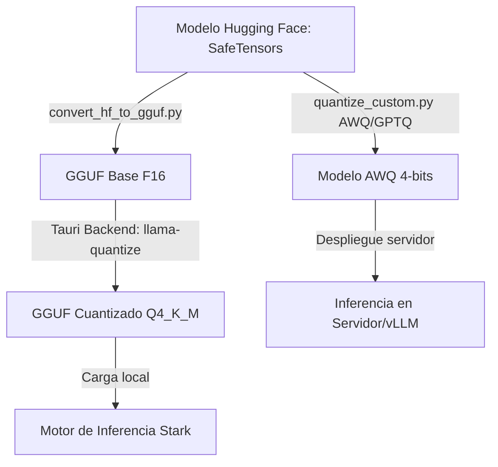

# Plan de Implementación Avanzado: Cuantificación de LLMs en Stark

Este documento actualiza y amplía el plan de implementación de cuantificación de modelos en **Stark**, alineando las nuevas herramientas basadas en scripts de Python (AWQ/GPTQ/GGUF) con la **arquitectura nativa existente** en la aplicación.

---

## 1. Mapeo de la Arquitectura Existente (Aprendizaje del Código)

Al analizar el código del repositorio, identificamos que Stark ya posee soporte nativo para cuantificación en el backend y frontend:

- **Backend Rust (`src-tauri/src/local/quantize.rs`):** Posee implementada la lógica para invocar las utilidades binarias nativas `llama-quantize` y `llama-imatrix` de `llama.cpp` a través de `run_pipeline`. Habilita calibración por matriz de importancia (`imatrix`) con un texto de calibración por defecto (`DEFAULT_CALIBRATION`).
- **Frontend Preact (`src/components/ModelSelectorModal.jsx`):** Contiene la función `runQuantize()` que invoca el comando Tauri `quantize_run`, permitiendo seleccionar un archivo `.gguf` original y cuantificarlo a formatos como `Q4_K_M`, `Q8_0`, etc.

El objetivo de este plan es **complementar** este pipeline nativo con capacidades avanzadas de conversión desde Hugging Face (SafeTensors/PyTorch) y cuantificación avanzada basada en GPU/CPU (`AutoAWQ`, `AutoGPTQ`).

---

## 2. Nueva Arquitectura Integrada

Las nuevas utilidades se estructuran bajo `/scripts/quantization` y actúan como un puente de preparación antes de usar la cuantificación nativa:

```
stark/
├── src-tauri/src/local/quantize.rs    # Cuantificación nativa GGUF (Rust)
├── scripts/
│   └── quantization/
│       ├── setup.sh                   # Entorno virtual y dependencias
│       ├── convert_hf_to_gguf.py      # Conversor Hugging Face -> GGUF (F16)
│       └── quantize_custom.py         # Cuantificador AWQ/GPTQ y calibrador
└── llm_quantization_plan.md           # Este plan
```

---

## 3. Fases de Implementación Ampliadas

### Fase 1: Inicialización de Herramientas y Detección de GPU

- **Scripts:** `setup.sh` y `utils/hardware.py`.
- **Detalle:**
  - Configura un entorno virtual aislado `.venv-quantize`.
  - Instala dependencias necesarias: `torch`, `transformers`, `autoawq`, `auto-gptq`, `gguf`.
  - Realiza chequeo de recursos de hardware (Memoria RAM, VRAM de GPU NVIDIA mediante `nvidia-smi` si está disponible).

### Fase 2: Conversión Hugging Face a GGUF (F16/F32)

- **Script:** `convert_hf_to_gguf.py`.
- **Propósito:** Los binarios nativos de `llama.cpp` integrados en el backend de Stark requieren un archivo GGUF base (usualmente en precisión F16) para poder cuantificar a bits más bajos. Este script de Python automatiza la descarga de un modelo desde Hugging Face (en formato SafeTensors/PyTorch) y lo convierte a un GGUF inicial de 16 bits sin pérdida.
- **Integración:** Una vez generado el archivo base de 16 bits, el usuario puede importarlo en el frontend de Stark (`ModelSelectorModal.jsx`) y utilizar la herramienta nativa ultra-rápida de Rust para cuantificar a `Q4_K_M` u otros formatos con un solo clic.

### Fase 3: Calibración y Cuantificación AWQ/GPTQ (GPU & Fallback CPU)

- **Script:** `quantize_custom.py`.
- **Propósito:** Generar modelos altamente optimizados en formatos no-GGUF (AWQ/GPTQ) para despliegues en servidores o integraciones de inferencia rápida.
- **Características:**
  - Permite cargar un archivo de texto de calibración personalizado (o usa el `DEFAULT_CALIBRATION` alineado con el backend de Rust).
  - **Modo Acelerado (GPU):** Ejecuta la cuantificación en 4 bits usando los algoritmos de AutoAWQ o AutoGPTQ para maximizar la calidad por parámetro en GPUs.
  - **Modo Fallback (CPU):** Si no hay CUDA disponible, utiliza cuantificación básica de pesos basada en CPU para modelos muy pequeños (e.g. 1B-3B parámetros) y avisa al usuario sobre la degradación de rendimiento esperada.

---

## 4. Flujo de Trabajo Completo Recomendado



---

## 5. Criterios de Aceptación y Validación

1. **Compilación de Frontend/Backend:** Los cambios y nuevos scripts no deben interferir en la compilación nativa de Tauri o Vite.
2. **Pipeline de Prueba:** Conversión de un modelo mini (e.g., `Qwen/Qwen2.5-0.5B`) de Hugging Face a GGUF F16 usando Python, y posterior cuantización a `Q4_K_M` en Stark.
3. **Validación de Respuestas:** El modelo final cuantificado debe cargarse exitosamente en Stark y responder con coherencia, manteniendo una degradación de inteligencia mínima.
